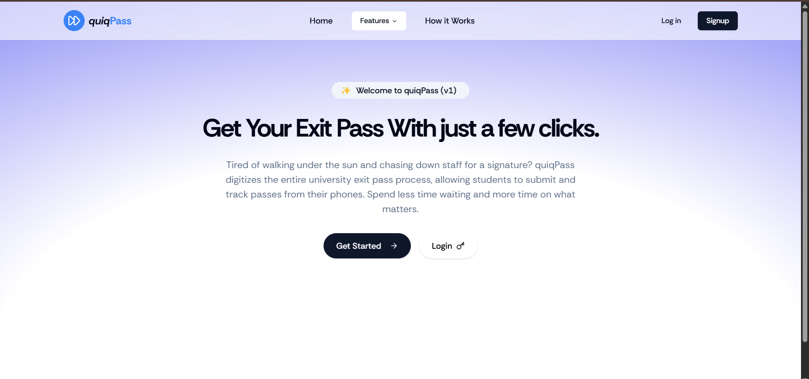
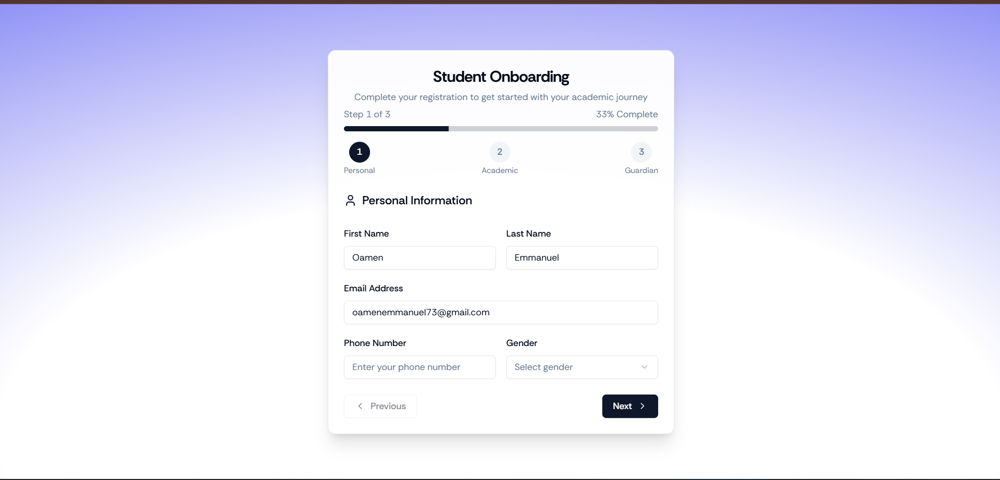

# QuiqPass - Exit Pass Management Software

[🌍 Live Demo](https://exit-pass-app.vercel.app) | [📄 Documentation](#) | [🐛 Report Issues](https://github.com/Emmycodez/QuiqPass-exit-pass-software/issues)


A modern, full-stack exit pass management system built with React-Routerv7 for efficient management of exit passes in private universities🏫. 

## 💡 Motivation

As a student in a private university, I often had to walk long distances just to get my exit pass approved,  even when i was sick 🤒. 
This process was time-consuming, frustrating, and inefficient. 

QuiqPass was born out of that experience — a digital solution to streamline exit pass requests, 
reduce paperwork, and make the process faster and more transparent for both students and administrators.

## 📸 Screenshots

### Hero Section 


### Onboarding Form
 

### Register Page
  

👉 Try it live: [QuiqPass Demo](https://exit-pass-app.vercel.app)


## 🌟 Features

- **Digital Pass Generation**: Student can apply for short and long passes from the student-dashboard
- **Real-time Tracking**: Monitor entry and exit activities in real-time.
- **Student Management**: Comprehensive admin panel for managing students and permissions
- **Responsive Design**: Modern, mobile-friendly interface built with TailwindCSS
- **Secure Authentication**: Robust user authentication and authorization system
- **Reporting & Analytics**: Generate detailed reports on pass usage and visitor statistics
- **QR Code Integration**: Quick scanning capabilities for seamless entry/exit process

## 🚀 Tech Stack

- **Frontend/Backend**: React-routerV7, TypeScript
- **Styling**: TailwindCSS, ShadcnUI
- **DB & AUTH**: Supabase
- **Build Tool**: Vite with HMR (Hot Module Replacement)
- **Server**: Node.js with server-side rendering
- **Package Manager**: npm/pnpm/bun support

## 📋 Prerequisites

Before you begin, ensure you have the following installed:
- Node.js (version 16 or higher)
- npm, pnpm, or bun package manager

## 🛠️ Installation

1. **Clone the repository**
   ```bash
   git clone https://github.com/Emmycodez/QuiqPass-exit-pass-software.git
   cd QuiqPass-exit-pass-software
   ```

2. **Install dependencies**
   ```bash
   npm install
   # or
   pnpm install
   # or
   bun install
   ```

3. **Start the development server**
   ```bash
   npm run dev
   # or
   pnpm dev
   # or
   bun dev
   ```

4. **Open your browser**
   Navigate to `http://localhost:5173` to view the application

## 🏗️ Build & Deployment

### Development Build
```bash
npm run build
```

### Docker Deployment

The project includes optimized Dockerfiles for different package managers:

**Using npm:**
```bash
docker build -t quiqpass .
docker run -p 3000:3000 quiqpass
```

**Using pnpm:**
```bash
docker build -f Dockerfile.pnpm -t quiqpass .
docker run -p 3000:3000 quiqpass
```

**Using bun:**
```bash
docker build -f Dockerfile.bun -t quiqpass .
docker run -p 3000:3000 quiqpass
```

### Cloud Deployment

This project can be easily deployed on vercel `https://vercel.com/` 

The containerized application can be deployed to:
- AWS ECS
- Google Cloud Run
- Azure Container Apps
- Digital Ocean App Platform
- Fly.io
- Railway
- Vercel
- Netlify

## 📁 Project Structure

```
QuiqPass/
├── package.json
├── package-lock.json
├── build/
│   ├── client/          # Static assets
│   └── server/          # Server-side code
├── src/
│   ├── components/      # Reusable UI components
│   ├── pages/          # Application pages
│   ├── hooks/          # Custom React hooks
│   ├── utils/          # Utility functions
│   ├── styles/         # CSS and styling files
│   └── types/          # TypeScript type definitions
├── public/             # Public assets
├── Dockerfile*         # Docker configurations
└── README.md
```

## 🎯 Usage

### Student Onboarding
- Students can register on the platform
- Fill in their information in the onboarding form
- Apply for either a long or short pass

### Hostel Porter Panel
- Hostel porters receive notifications when a student from their hostel applies for a pass
- Forward pass applications to the CSO or reject pass applications.

### Admin Panel
- Access the admin dashboard to manage student and system settings
- View Student Pass application information
- Approve or Reject Passes
- View Analytics and Data on student movement through out the school
- Monitor real-time entry/exit activities
- Generate comprehensive reports


### Pass Verification
- Scan QR codes at entry/exit points
- Verify pass validity and user details
- Log entry/exit activities automatically

## 🔧 Configuration

Create a `.env` file in the root directory with your configuration:

```env
# Supabase Configuration
VITE_SUPABASE_URL=your_vite_auth_url
VITE_SUPABASE_ANON_KEY= your_supabase_anon_key
VITE_BASE_URL = your_application_base_url: likely `http://localhost:5173` or url_in_production

# Application Settings
PORT=3000
NODE_ENV=production
```

## 🤝 Contributing

We welcome contributions! Please follow these steps:

1. Fork the repository
2. Create a feature branch (`git checkout -b feature/amazing-feature`)
3. Commit your changes (`git commit -m 'Add amazing feature'`)
4. Push to the branch (`git push origin feature/amazing-feature`)
5. Open a Pull Request

### Coding Standards
- Follow TypeScript best practices
- Use meaningful variable and function names
- Write clean, documented code
- Ensure all tests pass before submitting

## 📄 License

This project is licensed under the MIT License - see the [LICENSE](LICENSE) file for details.

## 👨‍💻 Author

**Emmanuel** - [@Emmycodez](https://github.com/Emmycodez)  

I’m a Software Engineering student passionate about solving real problems with technology.  
QuiqPass was inspired by my own challenges as a student navigating outdated exit pass systems, 
and reflects my interest in learning new technologies and building scalable, user-focused software.


## 🆘 Support

If you encounter any issues or have questions:

1. Check the [Issues](https://github.com/Emmycodez/QuiqPass-exit-pass-software/issues) section
2. Create a new issue with detailed information
3. Contact the maintainer directly

## 🙏 Acknowledgments

- Built with React Routerv7 for robust routing capabilities
- Styled with TailwindCSS and ShadcnUI for modern, responsive design
- Database and Auth using Supabase
- Deployed on Vercel
- Thanks to all contributors who help improve this project

---

⭐ If you find this project helpful, please consider giving it a star on GitHub!